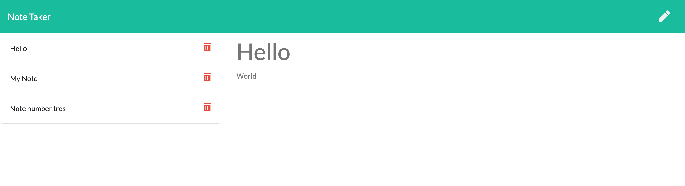

# Notepad

## Installation

Deployment: https://warm-stream-97464.herokuapp.com/notes

GitHub: https://github.com/jenryhennifer/noteTaker

Heroku: https://dashboard.heroku.com/apps/warm-stream-97464

<hr />

## Technologies

* HTML
* CSS
* JavaScript
* Servers
* npm
    * express
    * inquirer
    * uuidv4
* JSON 

<hr />

## Sample




<hr />

## Description

The purpose of this project was to create a note that will save new notes and delete old notes when requested by the user. This is for users that need to keep track of information and delete topics that they don't need anymore.

Express was installed from npm to allow access to the servers adn files. All the notes were saved into a json file.


During testing a local server PORT was used. The port listeners were called using express:

```
app.listen(PORT, function () {
    console.log("App listening on PORT " + PORT);
});
```

Once the app was deployed to Heroku it ran throught the relevent environment port:

```
var PORT = process.env.PORT || 8080;
```
app.get was used to retrieve the proper files for the page names. / was given to index.html and /notes was given to notes.html while /api/notes allowed for the notes data to be saved within the JSON file.

When a file is saved express uses app.post to save the data to the JSON file. Every note is given a unique id using the npm library : uuidv4.

```
newNote.id = uuidv4(); 

```

The notes are then written to the JSON file. Express allows for files to be deleted based on the ID of the note that is chosen to be removed.


<hr />

## License

MIT License

Copyright (c) 2020 Jennifer Henry

Permission is hereby granted, free of charge, to any person obtaining a copy of this software and associated documentation files (the "Software"), to deal in the Software without restriction, including without limitation the rights to use, copy, modify, merge, publish, distribute, sublicense, and/or sell copies of the Software, and to permit persons to whom the Software is furnished to do so, subject to the following conditions:

The above copyright notice and this permission notice shall be included in all copies or substantial portions of the Software.

THE SOFTWARE IS PROVIDED "AS IS", WITHOUT WARRANTY OF ANY KIND, EXPRESS OR IMPLIED, INCLUDING BUT NOT LIMITED TO THE WARRANTIES OF MERCHANTABILITY, FITNESS FOR A PARTICULAR PURPOSE AND NONINFRINGEMENT. IN NO EVENT SHALL THE AUTHORS OR COPYRIGHT HOLDERS BE LIABLE FOR ANY CLAIM, DAMAGES OR OTHER LIABILITY, WHETHER IN AN ACTION OF CONTRACT, TORT OR OTHERWISE, ARISING FROM, OUT OF OR IN CONNECTION WITH THE SOFTWARE OR THE USE OR OTHER DEALINGS IN THE SOFTWARE.


<hr />
<hr />

# Author

* [LinkedIn](https://www.linkedin.com/in/jennifer-henry-4a540a149/)
* [GitHub](https://github.com/jenryhennifer)
* jenhenry1995@gmail.com